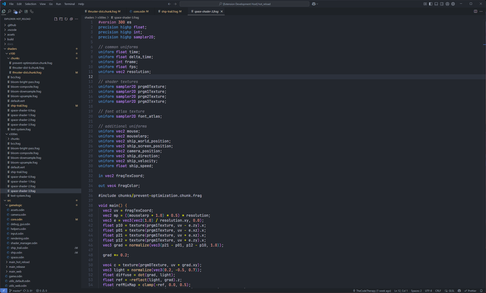

# [Bifröst](https://marketplace.visualstudio.com/items?itemName=thecodetherapy.bitfrost-code-theme)

## [GitHub Repo](https://github.com/thecodetherapy/bifrost)

Enhanced theme with improved semantic token support and refined color mappings for better code readability.

Bifröst is a fork of the popular OneDark Pro theme, with a complete update on the color-scheme and additions to the semantic token support I wanted (especially for Odin language and GLSL shaders), for improved color differentiation and refined visual hierarchy.

## Screenshots

### Bifröst (Default)


### Bifröst Darker




### Bifröst Flat


### Bifröst Mix


### Bifröst Night Flat


### Suggest Editor Settings
```
  "editor.fontSize": 17,
  "editor.lineHeight": 23,
  "editor.fontFamily": "'JetBrainsMono Nerd Font'",
  "editor.semanticHighlighting.enabled": true,
  "editor.renderWhitespace": "trailing",
  "editor.minimap.enabled": false,
  "files.trimTrailingWhitespace": true,
  "explorer.compactFolders": false,
  "workbench.startupEditor": "none",
  "workbench.activityBar.location": "top",
  "editor.semanticTokenColorCustomizations": {
    "enabled": true,
    "[Bifröst]": {
      "enabled": true,
      "rules": {}
    }
  },
```

JetBrains Mono Download: https://github.com/ryanoasis/nerd-fonts/releases/download/v3.4.0/JetBrainsMono.zip

### Tweaks & theming

If you want to play around with new colors, use the setting
`workbench.colorCustomizations` to customize the currently selected theme. For
example, you can add this snippet in your "settings.json" file:

```json
"workbench.colorCustomizations": {
  "tab.activeBackground": "#282c34",
  "activityBar.background": "#282c34",
  "sideBar.background": "#282c34",
  "tab.activeBorder": "#d19a66",
}
```

or use the setting `editor.tokenColorCustomizations`

```json
"editor.tokenColorCustomizations": {
  "[Bifröst]": {
    "textMateRules": [
      {
        "scope": ["source.python"],
        "settings": {
          "foreground": "#e06c75"
        }
      }
    ]
  }
}
```

#### Italic

You could set this in your setting.json to make code be italic

```json
"editor.tokenColorCustomizations": {
    "textMateRules": [
      {
        "name": "italic font",
        "scope": [
          "comment",
          "keyword",
          "storage",
          "keyword.control",
          "keyword.control.from",
          "keyword.control.flow",
          "keyword.operator.new",
          "keyword.control.import",
          "keyword.control.export",
          "keyword.control.default",
          "keyword.control.trycatch",
          "keyword.control.conditional",
          "storage.type",
          "storage.type.class",
          "storage.modifier.tsx",
          "storage.type.function",
          "storage.modifier.async",
          "variable.language",
          "variable.language.this",
          "variable.language.super",
          "meta.class",
          "meta.var.expr",
          "constant.language.null",
          "support.type.primitive",
          "entity.name.method.js",
          "entity.other.attribute-name",
          "punctuation.definition.comment",
          "text.html.basic entity.other.attribute-name",
          "tag.decorator.js entity.name.tag.js",
          "tag.decorator.js punctuation.definition.tag.js",
          "source.js constant.other.object.key.js string.unquoted.label.js",
        ],
        "settings": {
          "fontStyle": "italic",
        }
      },
    ]
  }
```

[more info](https://github.com/thecodetherapy/bifrost)

## Python & Pylance users
Python users I recommend using [Pylance](https://marketplace.visualstudio.com/items?itemName=ms-python.vscode-pylance) extension for fast, feature-rich language support.

Semantic colors can be customized in settings.json by associating the Pylance semantic token types and modifiers with the desired colors.

- Semantic token types

  - class, enum
  - parameter, variable, property, enumMember
  - function, member
  - module
  - intrinsic
  - magicFunction (dunder methods)
  - selfParameter, clsParameter

- Semantic token modifiers
  - declaration
  - readonly, static, abstract
  - async
  - typeHint, typeHintComment
  - decorator
  - builtin

The [scope inspector](https://code.visualstudio.com/api/language-extensions/syntax-highlight-guide#scope-inspector) tool allows you to explore what semantic tokens are present in a source file and what theme rules they match to.

Example of customizing semantic colors in settings.json:

```jsonc
{
  "editor.semanticTokenColorCustomizations": {
    "[Bifröst]": {
      // Apply to this theme only
      "enabled": true,
      "rules": {
        "magicFunction:python": "#ee0000",
        "function.declaration:python": "#990000",
        "*.decorator:python": "#0000dd",
        "*.typeHint:python": "#5500aa",
        "*.typeHintComment:python": "#aaaaaa",
        "parameter:python": "#aaaaaa"
      }
    }
  }
}
```

Please check the official documentation,
[Theme Color Reference](https://code.visualstudio.com/docs/getstarted/theme-color-reference) and
[Theme Color](https://code.visualstudio.com/docs/getstarted/themes), for more helpful information.
[More info](https://code.visualstudio.com/updates/v1_15#_user-definable-syntax-highlighting-colors)
